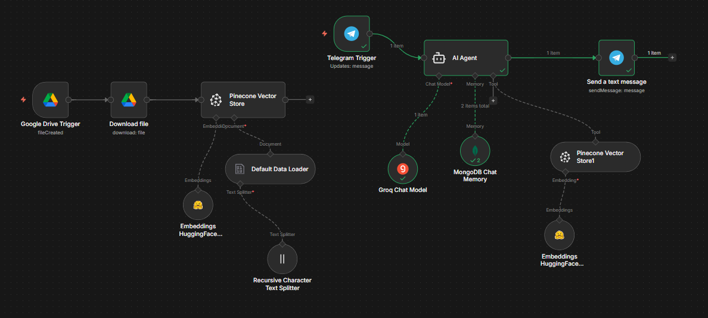
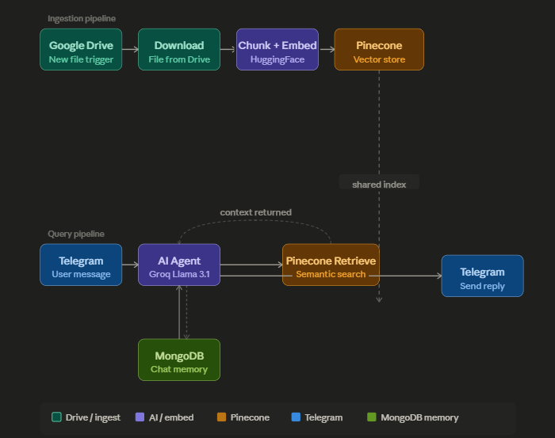

# RAG n8n Workflow (Google Drive + Pinecone + Telegram Bot)

This repository contains a production-ready **Retrieval-Augmented Generation (RAG)** workflow for **n8n**. It automates document ingestion from Google Drive, processes and embeds the text, stores it in Pinecone, and hosts a Telegram AI assistant that retrieves information from the index while maintaining conversational history in MongoDB.

## 📷 Workflow Preview

---

## 🛠️ Workflow Architecture

The workflow is divided into two main components:

### 1. Document Ingestion Pipeline
* **Trigger**: Google Drive trigger watches a designated folder (e.g., `FAQ_N8N`) for newly created files.
* **Download**: Downloads the document from Google Drive.
* **Document Loading & Splitting**: Loads the file data and splits it using the **Recursive Character Text Splitter** to ensure optimal chunk sizes.
* **Embeddings**: Generates vector embeddings using the **Hugging Face Inference API**.
* **Vector Store**: Upserts the document chunks into a **Pinecone** index (`demo-n8n`) under a specific namespace (`FAQ`).

### 2. Telegram AI Chat Assistant
* **Trigger**: Triggers on incoming Telegram messages sent to your bot.
* **AI Agent**: Orchestrates responses using **Groq Chat Models** (e.g., `openai/gpt-oss-20b` or other supported models).
* **Tools**: Uses the Pinecone vector store index as a custom retrieval tool to search for context about the ingested documents.
* **Memory**: Utilizes **MongoDB Chat Memory** (`chat_history` collection in `n8n_memory` database) to persist session history using the Telegram Chat ID.
* **Output**: Sends formatting-restricted, clean, concise answers back to the Telegram user.

---

## 🎥 Demo Video

Here is a short screen recording showing the workflow and bot in action:

<video src="assets/demo-recording.mp4" width="100%" controls></video>

---

## 📋 Prerequisites

To run this workflow, you will need active accounts and credentials for the following services:

1. **n8n** (Self-hosted or Cloud instance)
2. **Google Cloud Console** (with Google Drive API enabled and OAuth2 Credentials configured in n8n)
3. **Hugging Face** (API Token for inference embeddings)
4. **Pinecone** (API Key, Index Name, and Environment)
5. **Groq** (API Key for access to fast LLMs)
6. **Telegram** (Bot Token, obtained by creating a bot via [@BotFather](https://t.me/BotFather))
7. **MongoDB** (Connection String/URI for chat history storage)

---

## 🚀 How to Set Up

### Step 1: Import the Workflow
1. Download or copy the contents of the [rag-workflow.json](rag-workflow.json) file.
2. In your n8n dashboard, create a new workflow.
3. Click the menu button (three dots) in the top-right corner and select **Import from File** (or simply paste the JSON content directly onto the n8n canvas).

### Step 2: Configure Credentials
Set up credentials for the following nodes:
* **Google Drive Trigger** & **Download file**: Link your Google Drive account via OAuth2.
* **Embeddings HuggingFace Inference**: Input your Hugging Face API token.
* **Pinecone Vector Store** & **Pinecone Vector Store1**: Input your Pinecone API credentials.
* **Groq Chat Model**: Configure your Groq API Key.
* **Telegram Trigger** & **Send a text message**: Provide your Telegram Bot API Token.
* **MongoDB Chat Memory**: Input your MongoDB connection credentials.

### Step 3: Configure Parameters
* **Google Drive Folder**: In the **Google Drive Trigger** node, choose the specific folder you want to watch.
* **Pinecone Index & Namespace**: Ensure the index name (default: `demo-n8n`) and namespace (default: `FAQ`) match your Pinecone settings.
* **Agent System Prompt**: Customize the system rules inside the **AI Agent** node if you want to alter the bot's behavior or personality.

### Step 4: Activate Workflow
Click the **Active** toggle in the top-right corner of the n8n canvas to deploy your workflow.

---

## 📂 File Structure

* `rag-workflow.json`: The complete export of the n8n RAG workflow.
* `README.md`: Project documentation and setup instructions.
* `assets/`: Media files showcasing the workflow interface.
* `.gitignore`: Excludes system configuration files.
